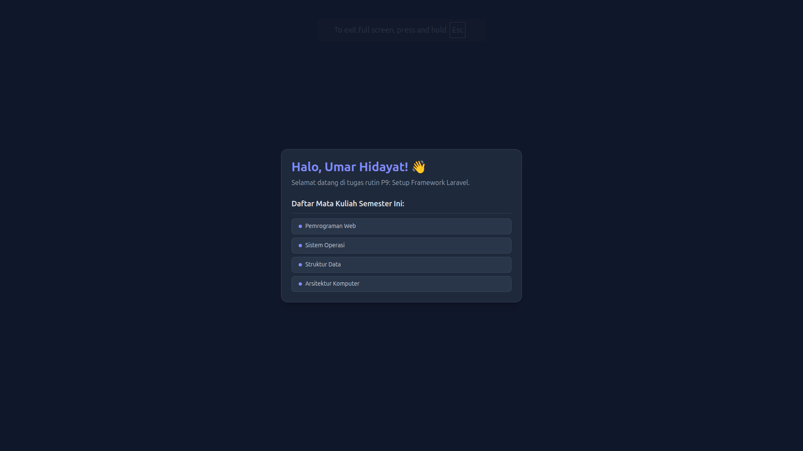

# Tugas Rutin 9 — Setup Framework Laravel

**Nama Praktikan:** Umar Hidayat  
**Program Studi:** Ilmu Komputer  
**Mata Kuliah:** Pemrograman Web (Ganjil 2026/2027)  
**Dosen Pengampu:** Adidtya Perdana, S.T., M.Kom  
**Nama Repository:** `TugasWeb-P9-LaravelSetup`  
**Versi Laravel:** 13.33.0  

---

## 📌 Ringkasan Proyek
Repositori ini berisi implementasi **Tugas Rutin 9 (Pertemuan 9)** mengenai pemahaman arsitektur MVC, setup awal framework Laravel versi 13 di OS Ubuntu Linux, pemetaan routing HTTP dasar, penyajian Blade View dengan data dinamis, serta penggunaan Artisan CLI generator.

---

## 🛠️ Langkah Instalasi & Jalankan Server

1. **Clone Repositori & Masuk Direktori**
   ```bash
   git clone [https://github.com/umar-hidayat/TugasWeb-P9-LaravelSetup.git](https://github.com/umar-hidayat/TugasWeb-P9-LaravelSetup.git)
   cd TugasWeb-P9-LaravelSetup

```

2. **Install Dependensi Composer**
```bash
composer install

```


3. **Konfigurasi Environment (`.env`)**
Salin file `.env.example` menjadi `.env`:
```bash
cp .env.example .env

```


Atur koneksi basis data di `.env`:
```env
DB_CONNECTION=mysql
DB_HOST=127.0.0.1
DB_PORT=3306
DB_DATABASE=db_p9_laravel
DB_USERNAME=root
DB_PASSWORD=

```


4. **Generate Application Key & Jalankan Migrasi**
```bash
php artisan key:generate
php artisan migrate

```


5. **Jalankan Server Lokal**
```bash
php artisan serve

```


Akses melalui browser di `http://127.0.0.1:8000`

---

## 📁 Struktur Direktori Lengkap Proyek

```text
TugasWeb-P9-LaravelSetup/
├── app/
│   ├── Http/
│   │   └── Controllers/
│   │       ├── Controller.php                       # Base Controller
│   │       └── HomeController.php                   # Controller utama (make:controller)
│   ├── Models/
│   │   ├── Profile.php                              # Model Profile (make:model -m)
│   │   └── User.php                                 # Model bawaan User
│   └── Providers/                                   # Service Providers
├── bootstrap/
│   └── app.php                                      # Konfigurasi utama aplikasi & routing
├── config/                                          # Berkas konfigurasi aplikasi
├── database/
│   ├── factories/                                   # Model factories
│   ├── migrations/
│   │   ├── 0001_01_01_000000_create_users_table.php   # Migrasi tabel users
│   │   ├── 0001_01_01_000001_create_cache_table.php   # Migrasi tabel cache
│   │   ├── 0001_01_01_000002_create_jobs_table.php    # Migrasi tabel jobs
│   │   └── 2026_09_28_150058_create_profiles_table.php# Migrasi tabel profiles (artisan)
│   ├── seeders/                                     # Database seeders
│   └── database.sqlite                              # Basis data SQLite lokal
├── public/                                          # Document root (index.php & aset publik)
├── resources/
│   ├── css/                                         # Aset stylesheet mentah
│   ├── js/                                          # Aset JavaScript mentah
│   └── views/
│       ├── about.blade.php                          # View untuk route /about
│       ├── contact.blade.php                        # View untuk route /contact
│       └── welcome.blade.php                        # View utama dengan Tailwind CDN & data dinamis
├── routes/
│   ├── console.php                                  # Route perintah CLI
│   └── web.php                                      # Definisi route /, /about, /contact, & /hello/{nama}
├── screenshots/                                     # Folder dokumentasi screenshot tugas
│   └── Welcome_page.png                             # Tangkapan layar welcome page
├── storage/                                         # Penyimpanan log, cache, & upload
├── tests/                                           # Unit & Feature tests
├── vendor/                                          # Pustaka/dependensi Composer
├── .editorconfig                                    # Konfigurasi format teks editor
├── .env                                             # Konfigurasi environment & DB lokal
├── .env.example                                     # Template konfigurasi environment
├── .gitattributes                                   # Pengaturan Git attributes
├── .gitignore                                       # Daftar berkas/folder yang diabaikan Git
├── .npmrc                                           # Pengaturan NPM
├── AGENTS.md                                        # Catatan agen/proyek
├── artisan                                          # Eksekutif CLI Laravel Artisan
├── CLAUDE.md                                        # Catatan pedoman pengembangan
├── composer.json                                    # Daftar dependensi paket PHP/Laravel
├── composer.lock                                    # Kunci versi terpasang dependensi PHP
├── package.json                                     # Daftar dependensi Frontend/Vite
├── phpunit.xml                                      # Konfigurasi pengujian PHPUnit
├── README.md                                        # Dokumentasi resmi tugas
└── vite.config.js                                   # Konfigurasi bundler Vite

```

### Penjelasan Detail Struktur Utama (Laravel 13):

* **`app/`**: Otak dari aplikasi (Model & Controller).
* `app/Http/Controllers/`: Mengelola logika bisnis dan menjembatani data ke tampilan (`HomeController.php`).
* `app/Models/`: Merepresentasikan tabel basis data menggunakan Eloquent ORM (`Profile.php`, `User.php`).


* **`bootstrap/app.php`**: Berkas konfigurasi utama untuk memuat framework, merutekan middleware, dan menangani exception pada Laravel modern.
* **`database/migrations/`**: Mengelola version control skema tabel basis data (termasuk `create_profiles_table.php`).
* **`routes/web.php`**: Berisi peta URL yang menentukan rujukan file/view dari tiap permintaan HTTP.
* **`resources/views/`**: Menampung berkas Blade Templating (`.blade.php`) untuk menyajikan HTML ke pengguna (`welcome`, `about`, `contact`).
* **`screenshots/`**: Folder khusus menampung bukti gambar tangkapan layar untuk pengumpulan tugas (`Welcome_page.png`).

---

## ✅ Matriks Pemenuhan Rubrik Tugas Rutin 9

| No | Persyaratan Tugas (Slide 19) | Status | Bukti Implementasi |
| --- | --- | --- | --- |
| 1 | Install Composer & buat project (`composer create-project`) | **SELESAI** | Proyek terbuat dengan nama `TugasWeb-P9-LaravelSetup`. |
| 2 | Buat DB & Konfigurasi `.env` (MySQL) | **SELESAI** | `DB_DATABASE=db_p9_laravel` terhubung dan ter-migrate. |
| 3 | `artisan serve` berjalan + Screenshot welcome page | **SELESAI** | Server aktif di `http://127.0.0.1:8000`. |
| 4 | 3 Route Custom (`/`, `/about`, `/contact`) return Blade view | **SELESAI** | Terdefinisi di `routes/web.php` mengembalikan view masing-masing. |
| 5 | View menampilkan data dinamis (array dari route) | **SELESAI** | Array `$courses` dikirim dari route `/` dan di-loop dengan `@foreach`. |
| 6 | Gunakan `make:controller` & `make:model -m` minimal 1x | **SELESAI** | `Profile.php` (+ migration) & `HomeController.php` sukses dibuat. |
| 7 | README: Langkah install + penjelasan struktur folder | **SELESAI** | Tersemuat lengkap pada berkas `README.md` ini. |
| 8 | Repository GitHub: `TugasWeb-P9-LaravelSetup` | **SELESAI** | Repositori GitHub dipublis dengan struktur standar. |
| ★ | **Bonus:** Styling Welcome dengan Tailwind CDN | **SELESAI** | Tag `<script src="https://cdn.tailwindcss.com"></script>` pada `welcome.blade.php`. |
| ★ | **Bonus:** Route parameter `/hello/{nama}` | **SELESAI** | Route `/hello/{nama}` dibuat di `routes/web.php`. |

---

## 📸 Dokumentasi Screenshot Hasil Tampilan

### Halaman Welcome (`/`) — Data Dinamis & Tailwind CDN Bonus
